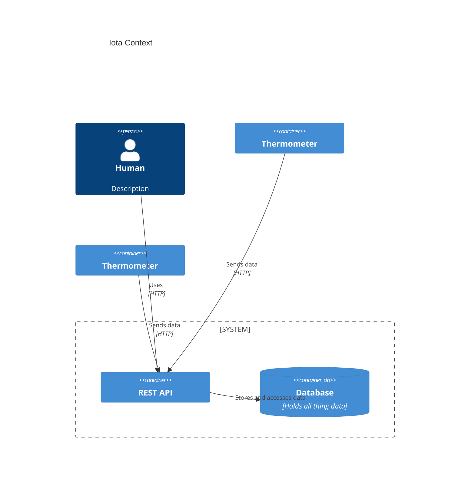

# Iota.jl

Intranet of Things Administrator. In Julia!

A relatively lightweight REST-based API for collecting Internet of Things data 
and simple data visualization with no consideration to security whatsoever.

Abandonded because the target platform was a Raspberry Pi 3, and dependency
hell made compiling and running there very difficult. See 
[iota]()
to see if I got any farther in Python.



## User Endpoints

### GET /
Main web browser landing point. Lists all registered things and displays their
latest values.

### GET /things/{thing_id}
Browser landing point for individual thing data visualization.

## API Endpoints

### GET /api/things
Returns a list of things registered with Iota.

Request:
```http
GET /api/things
```

Response:
```http
[
    "thing-1",
    ...
    "thing-n"
]
```

### POST /api/things
Register a new thing to Iota.

Request:
```http
POST /api/things

{
    id: <thing_id>,
    <field>: <type>,
    ...
}
```

Response when <thing_id> created:
```http
201 Created
```

Response when <thing_id> already exists, or request has errors in it:
```http
400 Bad Request
```

### GET /api/things/{thing_id}
Retrieve data for `thing_id`.

Query parameters:
* `last=N` -- return `N` most recent entries.
* `from=<primary key value>`, `to=<primary key value>` -- return range of entries

Request:
```http
GET /api/things/thermometer
```

Response:
```http
{
    "temperature": 27.1,
    "timestamp": 1689539566.039
}
```

No query params returns latest entry.

### PUT /api/things/{thing_id}
Update `thing_id` data.

Request:
```http
PUT /api/things/<thing_id>

{
    "<field>": <value>,
    ...
}
```

Response when `thing_id` exists:
```http
204 No Content
```

Response when `thing_id` does not exist:
```http
400 Bad Request
```

## Database Schema

### Things Table
* `thing_id`: integer (primary key)
* `name`: text

### Thing Table
Thing table columns are determined at table creation time.

## Dependencies

* Julia 1.8
* Oxygen.jl
* SQLite.jl

## License

MIT License. See LICENSE.txt for more information.
